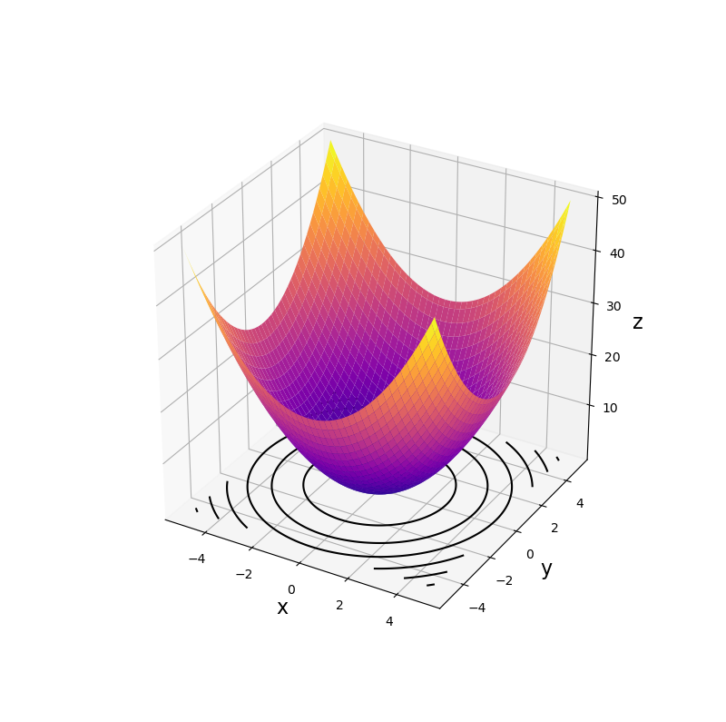
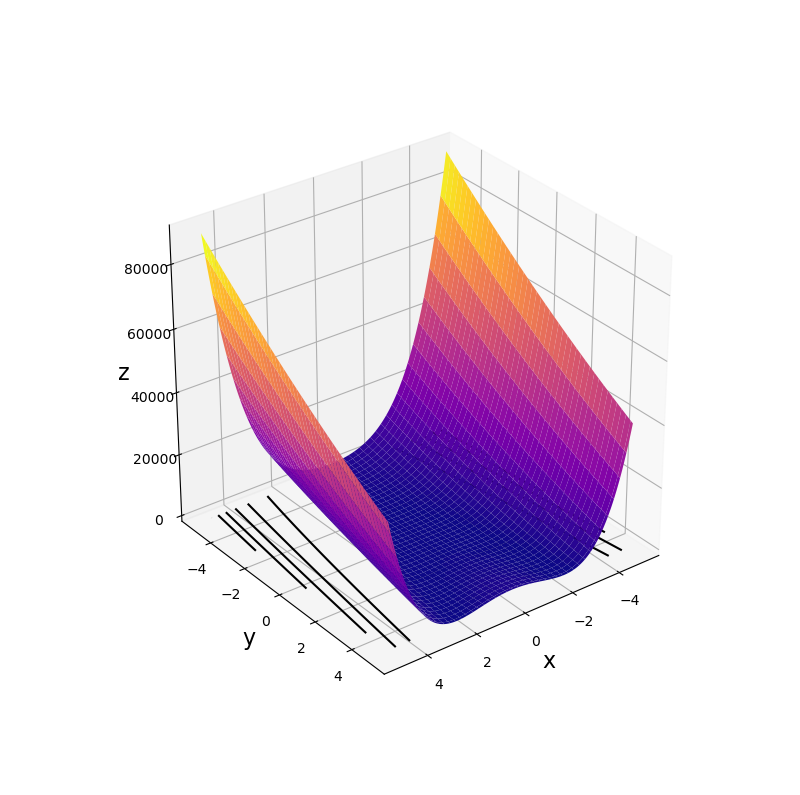
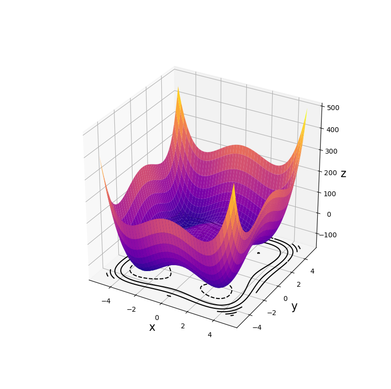
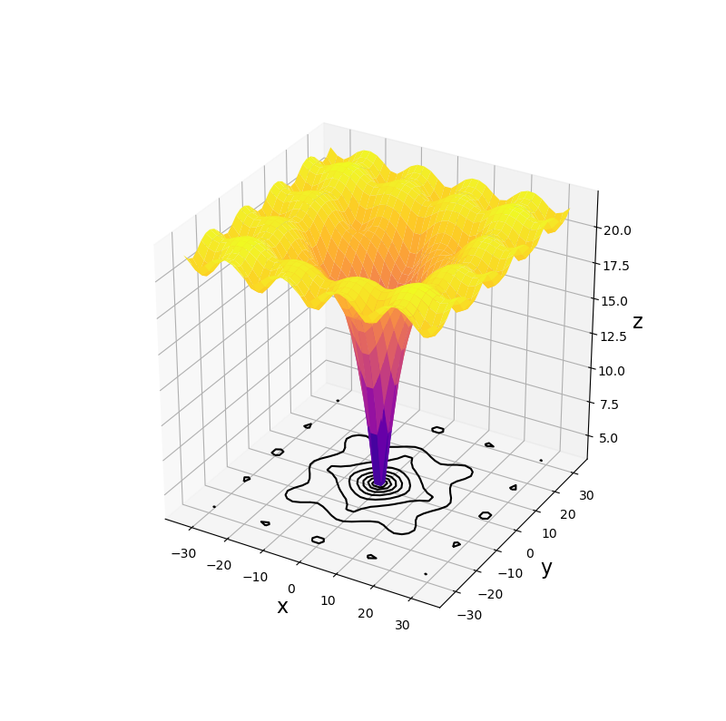
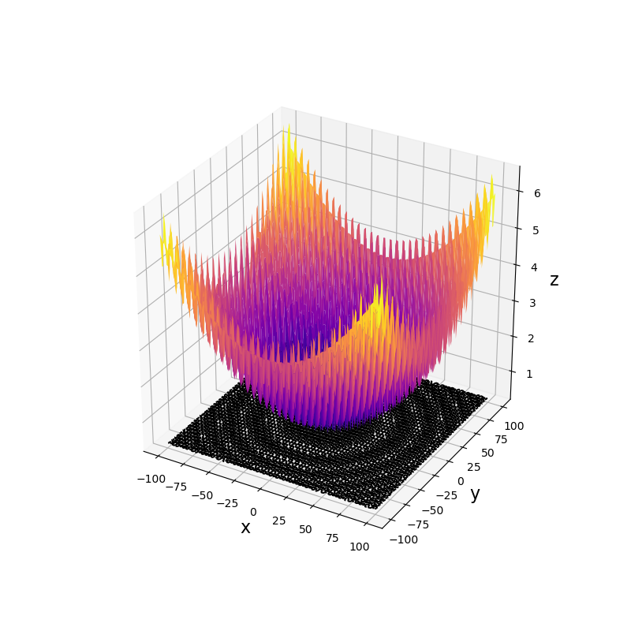
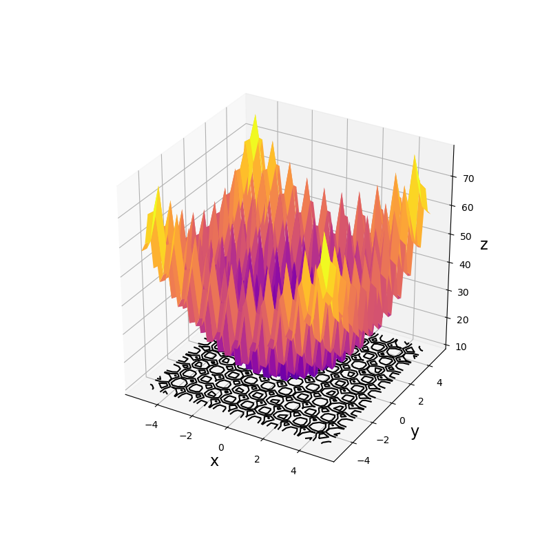
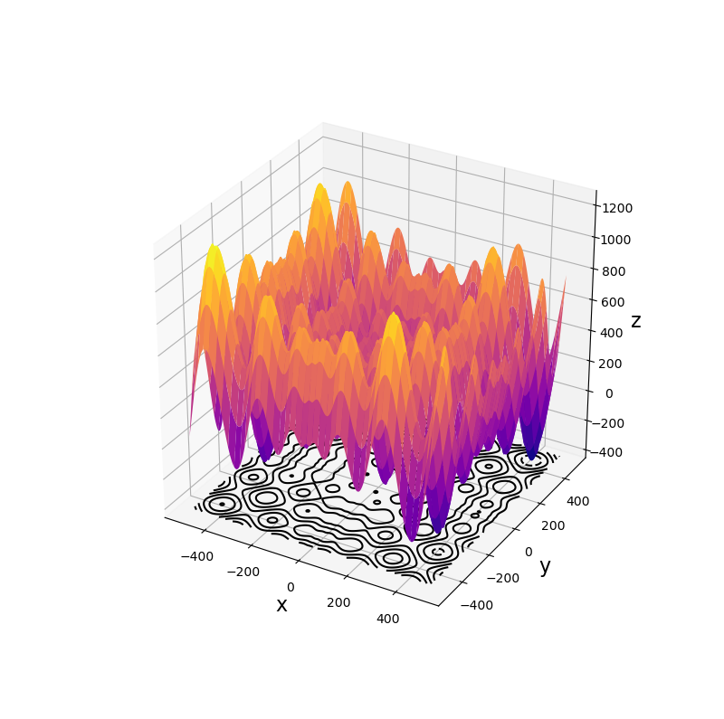

# Swarm Intelligence

This repository contains the programs I used during my undergraduate research on swarm intelligence, particularly focusing on Particle Swarm Optimization (PSO). 

I hope that by sharing this repository, it may contribute to the advancement of PSO research.

## Usage

### Preparation

Install the required packages with the following command:

```bash
$ pip install -r requirements.txt
```

## Example Implementation

```python
from function import unimodal, multimodal
from framework import PSO, PSOVC, BPSO, Swarm

# Number of dimensions
d = 2

# Benchmark functions
func = (
    unimodal.Sphere,
    unimodal.Rosenbrock,
    multimodal.TheNthPowerOfTwoMinma,
    multimodal.Ackley,
    multimodal.Rastrigin,
    multimodal.Griewank,
    multimodal.Schwefel,
)

# Simulation
for i in range(len(func)):
    f = func[i]()

    pso = PSO(
        Swarm(
            dimentions=d,
            position_min=f.x_min,
            position_max=f.x_max,
            velocity_max=0.5 * (f.x_max - f.x_min),
            velocity_min=-0.5 * (f.x_max - f.x_min),
        ),
        f,
    )

    psovc = PSOVC(
        Swarm(
            dimentions=d,
            position_min=f.x_min,
            position_max=f.x_max,
            velocity_max=0.5 * (f.x_max - f.x_min),
            velocity_min=-0.5 * (f.x_max - f.x_min),
        ),
        f,
    )

    bpso = BPSO(
        Swarm(
            dimentions=d,
            position_min=f.x_min,
            position_max=f.x_max,
            velocity_max=0.5 * (f.x_max - f.x_min),
            velocity_min=-0.5 * (f.x_max - f.x_min),
        ),
        f,
    )

    print(f.__class__.__name__, pso.simulate(d * 50))
    print(f.__class__.__name__, psovc.simulate(d * 50))
    print(f.__class__.__name__, bpso.simulate(d * 50))
```

# Implemented Algorithms

## PSO

### Full Name

Particle Swarm Optimization

### Reference

James Kennedy and Russell Eberhart. Particle swarm optimization.
In Proceedings of ICNN’95-international conference on neural networks, Vol. 4, pp. 1942–1948. IEEE, 1995.

## PSOVC

### Full Name

Particle Swarm Optimization using Velocity Control

### Reference

Naoya Nakagawa, Atsushi Ishigame, and Keiichiro Yasuda. Particle swarm
optimization using velocity control. 
IEEJ Transactions on Electronics, Information and Systems, Vol. 129, No. 7, pp. 1331–1338, 2009.

## BPSO

### Full Name

Boid Particle Swarm Optimization

### Reference

Zhihua Cui and Zhongzhi Shi. Boid particle swarm optimisation. 
International Journal of Innovative Computing and Applications, Vol. 2, No. 2, pp. 77–85, 2009.

# Available Benchmark Functions

## Unimodal Functions
### Sphere function
<div align="center">
    
</div>

$$
\begin{aligned}
     & \underset{x}{\text{min}}
     &                          & f(x) = &  & \sum_{i=1}^{D}x^{2}_{i}  \\
     & \text{subj.}
     &                          & \text{to}  &  & -5.0 \leq x_{i} \leq 5.0 \\
\end{aligned}
$$

---

### Rosenbrock function
<div align="center">
    
</div>

$$
\begin{aligned}
     & \underset{x}{\text{min}}
     &                          & f(x) = &  & \sum_{i=1}^{D-1} \left( 100 \left( x_{i+1}-x^{2}_{i} \right)^{2} + \left( x_{i}-1 \right)^{2} \right) \\
     & \text{subj.}
     &                          & \text{to}  &  & -5.0 \leq x_{i} \leq 5.0                                                                              \\
\end{aligned}
$$

---
## Multimodal Functions
### $2^{n}$-minima function
<div align="center">
    
</div>

$$
\begin{aligned}
     & \underset{x}{\text{min}}
     &                          & f(x) = &  & \sum_{i=1}^{D} \left( x^{4}_{i}-16x^{2}_{i}+5x_{i} \right) \\
     & \text{subj.}
     &                          & \text{to}  &  & -5.0 \leq x_{i} \leq 5.0                                   \\
\end{aligned}
$$

---

### Ackley function
<div align="center">
    
</div>

$$
\begin{aligned}
     & \underset{x}{\text{min}}
     &                          & f(x) = &  & -20 \exp \left( -0.2 \sqrt{\frac{1}{D} \sum_{i=1}^{D}x^{2}_{i}} \right)   \\
     &
     &                          &            &  & - \exp \left( \frac{1}{D} \sum_{j=1}^{D} \cos2 \pi x_{j} \right) + 20 + e \\
     & \text{subj.}
     &                          & \text{to}  &  & -32.768 \leq x_{i} \leq 32.768                                            \\
\end{aligned}
$$

---

### Griewank function
<div align="center">
    
</div>

$$
\begin{aligned}
     & \underset{x}{\text{min}}
     &                          & f(x) = &  & 1 + \frac{1}{4000} \sum_{i=1}^{D}x^{2}_i - \prod_{j=1}^{D} \cos \left( \frac{x_j}{\sqrt{j}} \right) \\
     & \text{subj.}
     &                          & \text{to}  &  & -600 \leq x_{i} \leq 600                                                                            \\
\end{aligned}
$$

---

### Rastrigin function
<div align="center">
    
</div>

$$
\begin{aligned}
     & \underset{x}{\text{min}}
     &                          & f(x) = &  & \sum_{i=1}^{D} \left( x^{2}_{i} - 10\cos \left(2 \pi x_{i} \right) + 10 \right) \\
     & \text{subj.}
     &                          & \text{to}  &  & -5.12 \leq x_{i} \leq 5.12                                                      \\
\end{aligned}
$$

---

### Schwefel function
<div align="center">
    
</div>

$$
\begin{aligned}
     & \underset{x}{\text{min}}
     &                          & f(x) = &  & 418.9829D + \sum_{i=1}^{D} \left( -x_{i} \sin \sqrt{\left\lvert x_{i} \right\rvert } \right) \\
     & \text{subj.}
     &                          & \text{to}  &  & -500 \leq x_{i} \leq 500                                                                     \\
\end{aligned}
$$
